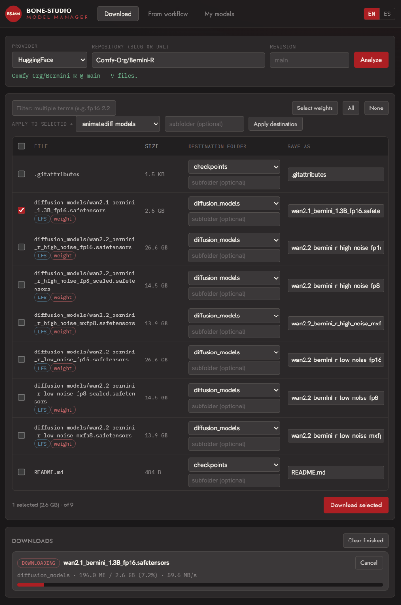
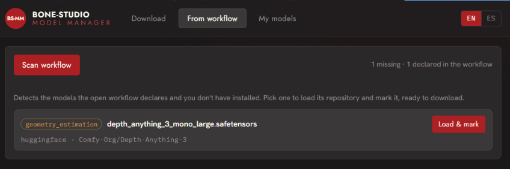
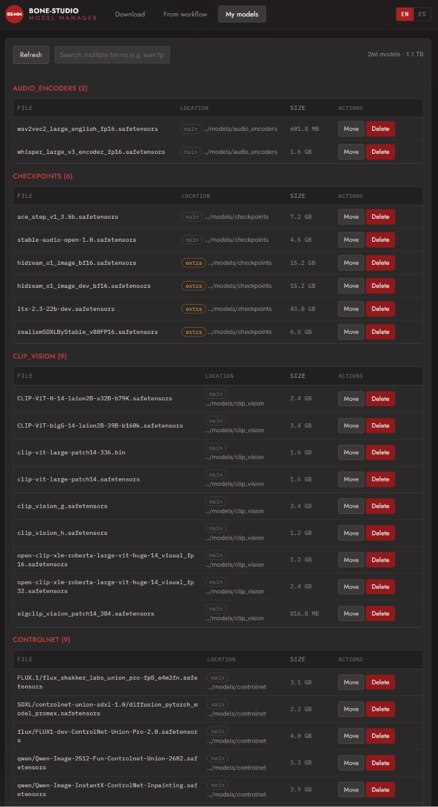

# Bone-Studio Model Manager — for ComfyUI

> **EN** · Download models from HuggingFace (no API key) and manage your local ComfyUI models —
> list, move and delete — all from a built-in panel that lives in its own iframe (Nodes 2.0 proof).
>
> **ES** · Descarga modelos de HuggingFace (sin API key) y gestiona tus modelos locales de ComfyUI
> —listar, mover y borrar— desde un panel propio dentro de un iframe (a prueba de Nodes 2.0).

&nbsp;·&nbsp; Bilingual EN/ES &nbsp;·&nbsp; Python 3.10–3.13 &nbsp;·&nbsp; stdlib only

---

## Screenshots / Capturas

### Download / Descargar
Analyze a HuggingFace repo, pick files, choose the destination folder (and optional subfolder), and download with live progress + resume.

### From workflow / Del workflow
Detects models the open workflow declares but you don't have installed, and loads them ready to download.

### My models / Mis modelos
A unified list of all your local models (including `extra_model_paths.yaml` locations), with move/delete.

---

## Features

- **Downloader** — paste a HuggingFace repo (`owner/name`) or URL, **Analyze**, and pick exactly which
  files to download. Choose the **destination folder** (`checkpoints`, `vae`, `diffusion_models`, `loras`,
  `text_encoders`, …) and an optional **subfolder**; rename on the fly. **No HuggingFace API key.**
  Large files download in the background with **progress, speed and automatic resume**. Multi-term filter
  (e.g. `fp16 2.2`).
- **From workflow** — scans the open workflow's declared models (`properties.models`) and lists the ones
  you don't have, resolved to the right repo + destination, one click away from downloading.
- **My models** — unified view of every local model grouped by folder, including paths added via
  `extra_model_paths.yaml` (tagged **extra**). **Move** between folders or **Delete**. Multi-term search.
- **Own UI** in an iframe (doesn't use the node graph) → won't break with **Nodes 2.0**. **Bilingual EN/ES**
  with in-app help.
- **Civitai-ready**: pluggable provider architecture (Civitai stub included, not yet implemented).

## Install

**From ComfyUI-Manager (recommended):** open the Manager → Custom Nodes → search **"Bone-Studio Model
Manager"** → Install, then restart ComfyUI.

**Manual:** copy this folder into `ComfyUI/custom_nodes/` and restart ComfyUI. No `pip install` needed
(**stdlib only**, Python 3.10–3.13). Open the **BS Models** tab in the sidebar.

## Usage

1. **Download** — enter a repo/URL → *Analyze* → tick files, set destination → *Download selected*.
2. **From workflow** — *Scan workflow* → *Load & mark* on a missing model → *Download selected*.
3. **My models** — *Move* or *Delete*; search with multiple terms.

Use the **?** icon (top-right, next to EN/ES) for in-app help.

---

## License / Licencia

**EN —** Code is licensed under the **GNU General Public License v3.0** (`GPL-3.0-only`); see
[`LICENSE`](LICENSE). Copyright © 2026 **Enob-Studio S.L. and Juan Gea**. As the sole copyright holders,
Enob-Studio S.L. and Juan Gea **reserve the right to relicense** this code under other terms (e.g.
Apache-2.0 or MIT) in the future.

- **Fonts:** the files under [`webapp/fonts/`](webapp/fonts) (Jost, Hanken Grotesk, IBM Plex Mono) are
  third-party fonts under the **SIL Open Font License 1.1** — see [`webapp/fonts/OFL.txt`](webapp/fonts/OFL.txt).
- **Brand:** the name **"Bone-Studio"** and the **BS-MM** logo are **trademarks of Enob-Studio S.L.**, all
  rights reserved, and are **not** covered by the GPL.

**ES —** El código se distribuye bajo la **Licencia Pública General de GNU v3.0** (`GPL-3.0-only`); ver
[`LICENSE`](LICENSE). Copyright © 2026 **Enob-Studio S.L. y Juan Gea**, que **se reservan el derecho a
relicenciar** el código bajo otros términos (p. ej. Apache-2.0 o MIT) en el futuro. Las **fuentes**
(`webapp/fonts/`) son de terceros bajo **SIL OFL 1.1**; la **marca** «Bone-Studio» y el logo **BS-MM** son
marcas de Enob-Studio S.L. (todos los derechos reservados, fuera de la GPL).

## Disclaimer / Descargo de responsabilidad

**EN — Use at your own risk.** This software is provided **"AS IS", without warranty of any kind**. It
downloads, moves and deletes model files at your request. To the maximum extent permitted by law,
Enob-Studio S.L. and Juan Gea are **not liable** for any damage, data loss, or for the content you
download or how you use it. (See also GPLv3 §§15–16 and [`NOTICE`](NOTICE).)

**ES — Úsalo bajo tu responsabilidad.** El software se ofrece **«tal cual», sin garantía de ningún tipo**.
Descarga, mueve y borra archivos de modelos a petición tuya. En la máxima medida permitida por la ley,
Enob-Studio S.L. y Juan Gea **no se responsabilizan** de ningún daño, pérdida de datos, ni del contenido
que descargues o de cómo lo utilices.
